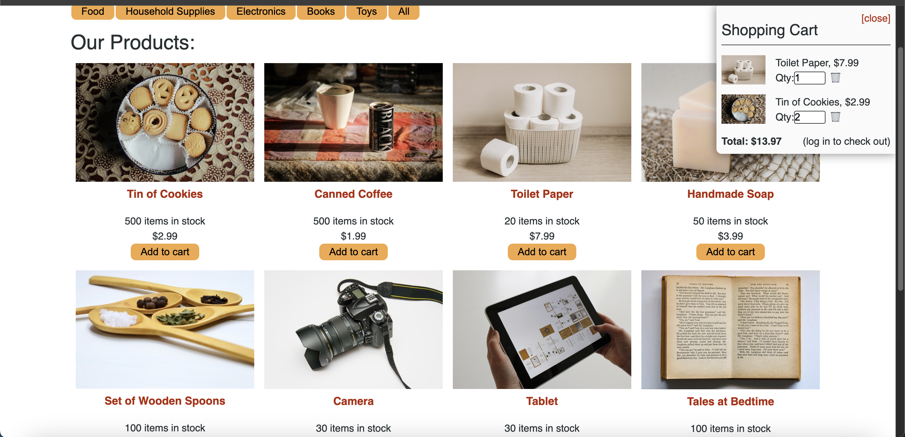

  # E-Commerce Redux Store

  

  ## Description
  This is an e-commerce site that was initially built with Context API that I have refactored using React Redux. This site iallows you to view and purchase products, add and remove them from your cart. 

  ## URL of Deployed Application

  [View my site on Render](https://e-commerce-redux-store.onrender.com)

  ## Screenshot of Deployed Application

  

  ## Table of Contents
  - [Installation](#installation)
  - [Usage](#usage)
  - [Contributing](#contributing)
  - [Tests](#tests)
  - [Technologies](#technologies)
  - [License](#license)
  - [Questions](#questions)

  ## Installation
  To run this on your local machine, clone my repository, run npm install, npm run seed and npm run build. Then run npm run develop to start the application. You canl also visit my site on rthe render link provided

  ## Usage
  This is an e-commerce site to purhcase goods. 

  ## Contributing
  N/A

  ## Tests
  N/A

  ## Technologies Used
  
* [![React][React.js]][React-url]
* [![Vite][Vite.js]][Vite-url]
* [![Express][Express.js]][Express-url]
* [![Graph][GraphQL]][GraphQL-url]
* [![Mongo][MongoDB]][MongoDB-url]
  

   ## License
  MIT

  ## Questions

  For any additional questions or feedback, please contact me with the following information:
  Github: (https://github.com/tjmcd2010)
  Email: (mailto:tjmcd2010@gmail.com)  

 <!-- MARKDOWN LINKS & IMAGES -->
<!-- https://www.markdownguide.org/basic-syntax/#reference-style-links -->
[contributors-shield]: https://img.shields.io/github/contributors/bmist41/Cal-Bootcamp-Alumni.svg?style=for-the-badge
[contributors-url]: https://github.com/bmist41/Cal-Bootcamp-Alumni/graphs/contributors
[forks-shield]: https://img.shields.io/github/forks/bmist41/Cal-Bootcamp-Alumni.svg?style=for-the-badge
[forks-url]: https://github.com/bmist41/Cal-Bootcamp-Alumni/network/members
[stars-shield]: https://img.shields.io/github/stars/bmist41/Cal-Bootcamp-Alumni.svg?style=for-the-badge
[stars-url]: https://github.com/bmist41/Cal-Bootcamp-Alumni/stargazers
[issues-shield]: https://img.shields.io/github/issues/bmist41/Cal-Bootcamp-Alumni.svg?style=for-the-badge
[issues-url]: https://github.com/bmist41/Cal-Bootcamp-Alumni/issues
[license-shield]: https://img.shields.io/github/license/bmist41/Cal-Bootcamp-Alumni.svg?style=for-the-badge
[license-url]: https://github.com/bmist41/Cal-Bootcamp-Alumni/blob/master/LICENSE.txt
[product-screenshot]: images/screenshot.png

[React.js]: https://img.shields.io/badge/React-20232A?style=for-the-badge&logo=react&logoColor=61DAFB
[React-url]: https://reactjs.org/
[Vite.js]: https://img.shields.io/badge/Vite-646CFF?style=for-the-badge&logo=Vite&logoColor=white
[Vite-url]: https://vitejs.dev
[ChakraUI]: https://shields.io/badge/chakra--ui-black?logo=chakraui&style=for-the-badge
[Chakra-url]: https://v2.chakra-ui.com/
[Express.js]: https://img.shields.io/badge/express-000000?style=for-the-badge&logo=express&logoColor=white
[Express-url]: https://expressjs.com
[GraphQL]: https://img.shields.io/badge/GraphQL-E434AA?style=for-the-badge&logo=graphql&logoColor=white
[GraphQL-url]: https://graphql.org/
[MongoDB]: https://img.shields.io/badge/-MongoDB-13aa52?style=for-the-badge&logo=mongodb&logoColor=white
[MongoDB-url]: https://www.mongodb.com

